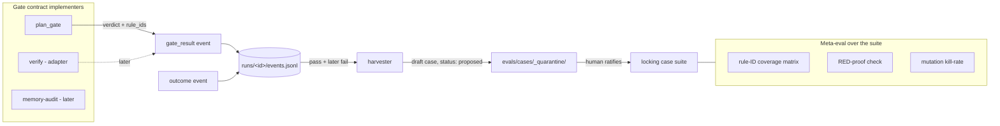

# feat: Eval Harness as the Factory's Self-Test Integration Layer

## Summary

Turn the single-component eval harness into the factory's self-test integration layer: a uniform
`Gate` contract that `plan_gate` implements (and `verify`/`memory-audit` plug into later),
deterministic meta-eval that makes suite adequacy provable (rule-ID taxonomy with enforced
coverage, recorded RED-proof, mutation kill-rate), and a human-ratified loop that harvests real
escapes from the existing event log into locked RED cases. Delivered in two phases: **Phase A**
(contract + meta-eval foundation), **Phase B** (gate-result emission, mutation, harvesting).

---

## Problem Frame

The harness (`evals/` + `src/agent_factory/plan_gate.py`) tests one deterministic component and is
fed entirely by hand. Three structural gaps (see origin):

1. **Adequacy unprovable** — a green suite means cases agree with the gate, not that the suite
   would catch a regression. Nothing flags a weak case (`gate_rejects(reason_contains=None)`
   passes on any rejection) or a green-from-birth case that never failed.
2. **No rule traceability** — `plan_gate` has three rules but no case→rule inventory, so a rule can
   ship with zero exercising cases (the H14 silent-gap class).
3. **Single-component, manual** — only `plan_gate` is covered; the highest-value cases (real
   escapes like H6/H10/H14) are hand-transcribed.

The integration seam already exists: `event_log.py` defines `gate_result` and `outcome` event
types. A `gate_result: passed` later contradicted by `outcome: failed` for the same task is a
harvestable false-admit escape — locally, with no Praxis dependency.

---

## Requirements Traceability

| Req (origin) | Covered by |
|---|---|
| R1 Gate contract + plan_gate refactor | U1 |
| R2 Component registry + ≥1 case/component meta-check | U1 |
| R3 Gates emit `gate_result` with rule-IDs | U4 |
| R4 Contract fits external-signal `verify` (adapter note) | U4 |
| R5 Stable rule-IDs surfaced in `reasons` | U2 |
| R6 Case declares rule-IDs; coverage meta-test + matrix | U2 |
| R7 RED-proof field + quarantine meta-test | U3 |
| R8 Mutation testing + wanted-case worklist | U5 |
| R9–R11 Harvester: draft cases, quarantine, idempotent | U6 |
| R12 Non-deterministic-case loader guard | U7 |

Success criteria SC1–SC6 and acceptance examples AE1–AE7 from the origin are mapped per-unit
under **Test scenarios** / **Verification**.

---

## Key Technical Decisions

- **KTD1 — Integration rides the existing event log, not a new bus.** Harvesting reads
  `runs/<run_id>/events.jsonl` via the existing `EventLog`; gates emit the existing `gate_result`
  type. No new transport. *(origin KD1)*
- **KTD2 — Harvesting covers false-admits only.** `gate_result: passed` + later `outcome: failed`
  = false-admit. False-rejects never produce an outcome and are out of harvest scope; mutation
  (U5) + hand-authored reject cases own that half. The split is stated in output, not hidden.
  *(origin KD2)*
- **KTD3 — RED-proof is dual-sourced.** Harvested cases carry the originating `gate_result` as RED
  evidence; hand-authored cases assert RED against a stored **broken-gate fixture** (a pinned
  mutant), chosen over commit-ref for worktree/time portability. *(origin KD3, OQ4)*
- **KTD4 — The `Gate` contract models deterministic input→verdict→rule-IDs.** `plan_gate` and
  `memory-audit` fit directly; external-signal `verify` conforms via a thin adapter wrapping
  exit-code signals in the verdict+rule-ID shape, not by adopting the structured input. *(origin
  KD4)*
- **KTD5 — Rule-IDs are structured, not parsed.** `evaluate_plan` returns reasons carrying an
  explicit `rule_id` field rather than a string prefix callers must parse. *(origin OQ1)*
- **KTD6 — Harvested cases land as files in a quarantine dir with `status: proposed`.** Promotion
  to the locking suite is moving the file / flipping `status: active` after human review; the
  runner ignores `proposed` cases for green-locking. *(origin OQ2)*
- **KTD7 — Mutation is report-first.** `mutmut` runs and reports kill-rate + a wanted-case
  worklist; it does **not** block CI this iteration (revisit once the threshold calibrates).
  *(origin OQ3)*

---

## High-Level Technical Design

Integration flow — how a gate verdict becomes a locked regression case:



Unit dependency graph:

```mermaid
flowchart TD
  U1[U1 Gate contract + registry] --> U2[U2 rule-IDs + coverage]
  U2 --> U3[U3 RED-proof]
  U1 --> U4[U4 gate_result emission + verify adapter]
  U2 --> U5[U5 mutation + worklist]
  U4 --> U6[U6 harvester]
  U3 --> U6
  U7[U7 loader guard] -.independent.-> U2
  classDef a fill:#e8f0fe; classDef b fill:#fef7e8;
  class U1,U2,U3,U7 a; class U4,U5,U6 b;
```

Phase A (blue): U1, U2, U3, U7. Phase B (amber): U4, U5, U6.

---

## Output Structure

New + modified files (per-unit `**Files:**` are authoritative):

```text
src/agent_factory/
  gate.py            # NEW — Gate Protocol, Verdict/Reason types, component registry
  plan_gate.py       # MODIFY — implement Gate, rule-IDs on reasons
evals/
  case_def.py        # MODIFY — rule_ids, red_proof, status fields
  checks.py          # MODIFY — dispatch via registry
  coverage.py        # NEW — rule×case matrix + coverage check
  red_proof.py       # NEW — broken-gate fixtures + RED-proof verification
  harvest.py         # NEW — event-log escape harvester
  cases/_quarantine/ # NEW — proposed harvested cases land here
tests/
  test_eval_cases.py     # MODIFY
  test_meta_coverage.py  # NEW
  test_red_proof.py      # NEW
  test_harvest.py        # NEW
  test_loader_guard.py   # NEW
pyproject.toml       # MODIFY — mutmut dev dep + config
```

---

## Implementation Units

### U1. Gate contract + plan_gate refactor + registry

**Goal:** Introduce a uniform `Gate` contract (input → verdict + structured reasons with rule-IDs)
and make `plan_gate` one implementation, dispatched through a component registry — without
changing current gate behavior.
**Requirements:** R1, R2 (SC5).
**Dependencies:** none.
**Files:** `src/agent_factory/gate.py` (new), `src/agent_factory/plan_gate.py` (modify),
`evals/checks.py` (modify), `tests/test_eval_cases.py` (modify).
**Approach:** Define a `Gate` Protocol with an `evaluate(input) -> Verdict` method; `Verdict`
carries `admitted: bool` and `reasons: list[Reason]`, where `Reason` carries `rule_id` + message
(KTD5). A `REGISTRY: dict[str, Gate]` maps component name → implementation; `produce_verdict`
dispatches through it (replacing today's `COMPONENT_RUNNERS`). `plan_gate.evaluate_plan` keeps its
signature but returns the structured verdict; characterize current behavior first so the refactor
is provably non-breaking.
**Execution note:** Add characterization coverage of current `plan_gate` verdicts before
refactoring (the existing 4 cases plus direct unit assertions), then refactor under green.
**Patterns to follow:** dataclass style in `src/agent_factory/plan_gate.py` and `tabular.py`;
registry-dispatch shape already sketched by `COMPONENT_RUNNERS` in `evals/checks.py`.
**Test scenarios:**
- Happy path: `plan_gate` registered as `"plan_gate"`; `produce_verdict("plan_gate", input)` returns
  the same admit/reject verdict as today for all four existing cases (characterization).
- Edge: unknown component name → explicit error (preserve current `ValueError`).
- Edge: a gate returning zero reasons is `admitted=True`; one+ reasons is `admitted=False`.
- Integration: `Covers AE-registry.` meta-check fails when a registered component has no case.
**Verification:** All existing eval cases pass unchanged; `plan_gate` is reached only via the
registry; verdict objects carry `rule_id`-tagged reasons.

### U2. Rule-ID taxonomy + coverage matrix

**Goal:** Give each `plan_gate` rule a stable rule-ID surfaced on its reasons; let each case declare
the rule-IDs it exercises; fail CI if any rule has zero exercising or zero RED cases.
**Requirements:** R5, R6 (SC2, AE1).
**Dependencies:** U1.
**Files:** `src/agent_factory/plan_gate.py` (modify), `evals/case_def.py` (modify),
`evals/coverage.py` (new), `tests/test_meta_coverage.py` (new), existing `case.yaml` files (modify
to add `rule_ids`).
**Approach:** Assign `R-ACCEPT-BINARY`, `R-NO-VAGUE`, `R-NO-DANGLING` as module-level constants;
each emitted reason carries its rule-ID. `EvalCase` gains an optional `rule_ids: list[str]`.
`coverage.py` builds a rule×case matrix and exposes `uncovered_rules()` (rules with zero
exercising cases) and `rules_without_red_case()`. A meta-test asserts both are empty for shipped
rules. Backfill `rule_ids` into the four existing `case.yaml` files.
**Patterns to follow:** `evals/case_def.py` dataclass + YAML load; reason construction in
`plan_gate.evaluate_plan`.
**Test scenarios:**
- Happy path: each of the three rules has ≥1 exercising case after backfill → coverage check passes.
- `Covers AE1.` Add a fourth rule constant with no case → `uncovered_rules()` returns it and the
  meta-test fails naming the rule-ID.
- Edge: a case declaring a rule-ID that does not exist → coverage check flags the dangling tag.
- Edge: matrix renders holes (rule present, zero cases) distinctly from covered cells.
**Verification:** Coverage meta-test green with backfilled cases; adding an unexercised rule turns
it red; matrix is renderable.

### U3. RED-proof field + quarantine meta-test

**Goal:** Record per-case falsifiability evidence; quarantine cases never observed failing so they
cannot contribute to coverage claims.
**Requirements:** R7 (SC3, AE2).
**Dependencies:** U2.
**Files:** `evals/case_def.py` (modify), `evals/red_proof.py` (new), `tests/test_red_proof.py`
(new), existing `case.yaml` files (modify to add `red_proof`).
**Approach:** `EvalCase` gains `red_proof` (one of: `harvested` with originating event ref, or
`fixture` naming a broken-gate fixture it must fail against — KTD3). `red_proof.py` provides the
broken-gate fixtures (pinned mutants, one per rule per OQ4 — start with per-rule) and a verifier
that runs a hand-authored case against its named fixture and asserts it goes RED there. A meta-test
marks cases with absent/unverifiable `red_proof` as decorative and excludes them from coverage
(U2 reads only RED-proven cases when computing `rules_without_red_case`).
**Execution note:** Build the broken-gate fixture for one rule first and assert an existing case
fails against it (real RED observation) before generalizing.
**Patterns to follow:** isolated-tenant probe style already used in the Praxis graph-check
(`derived_learning_not_merged_into_source`) — construct a deliberately-broken gate, assert failure.
**Test scenarios:**
- Happy path: a hand-authored reject case names a broken-gate fixture that wrongly admits its input
  → case goes RED against the fixture → `red_proof` verified.
- `Covers AE2.` A case with no `red_proof` → quarantined; excluded from coverage; meta-test reports it.
- Edge: a case whose `red_proof` fixture does **not** actually flip the verdict (case still passes
  against the broken gate) → flagged as a non-falsifying (bogus) RED-proof.
- Integration: a rule whose only case lacks verified RED-proof → U2's `rules_without_red_case`
  includes it (coverage and RED-proof compose).
**Verification:** Cases carry verified RED-proof; a decorative case is quarantined and surfaced;
coverage counts only RED-proven cases.

### U7. Non-deterministic-case loader guard

**Goal:** Refuse cases that encode non-deterministic concerns so the deterministic suite never goes
flaky; point them to a stress lane.
**Requirements:** R12 (AE6).
**Dependencies:** none (independent; lands in Phase A).
**Files:** `evals/case_def.py` (modify loader), `tests/test_loader_guard.py` (new).
**Approach:** `load_case`/`from_dict` scans the input block for time/ordering/IO-shaped keys
(e.g. `sleep`, `timeout`, `timestamp`, `concurrency`, `now`, `retries`) and raises at discovery
with a message pointing to a separate `stress/` lane. Conservative match list, documented and
extensible.
**Patterns to follow:** validation already in `EvalCase.from_dict` (raises on missing checks).
**Test scenarios:**
- `Covers AE6.` A `case.yaml` with a `timeout`/`latency` field → loader raises at discovery naming
  the offending field and the stress lane.
- Happy path: existing deterministic cases load unchanged.
- Edge: a benign field whose name merely contains a flagged substring (e.g. `now_admitted`) is not
  false-flagged (word-boundary / key-level match, not substring).
**Verification:** Flaky-shaped cases are rejected at discovery; all existing cases still load.

### U4. `gate_result` emission + verify-adapter fit note

**Goal:** Emit a `gate_result` event carrying component, verdict, and fired rule-IDs when a gate
runs; demonstrate the contract fits the external-signal `verify` gate via a thin adapter.
**Requirements:** R3, R4 (SC5, AE7).
**Dependencies:** U1.
**Files:** `src/agent_factory/gate.py` (modify — emission helper), `src/agent_factory/plan_gate.py`
(modify — emit on evaluate when a log is provided), a verify-adapter reference in `gate.py` or a
small `evals/` doc note, `tests/test_eval_cases.py` (modify), new emission test in
`tests/test_harvest.py` (shared with U6) or `tests/test_gate_emit.py`.
**Approach:** Add a helper that, given an `EventLog`, appends a `gate_result` event with
`{component, verdict, rule_ids}` (reuses the existing event type — no vocabulary change). Emission
is opt-in (only when a log is passed) so pure unit eval stays log-free. Provide a `verify` adapter
shape: a function mapping external-signal results (test/build/lint pass-fail) into a `Verdict` with
synthetic rule-IDs (e.g. `R-TESTS`, `R-LINT`), proving the contract is not `plan_gate`-specific
(KTD4). Do **not** wire live verify — adapter is contract-demonstration only.
**Test scenarios:**
- Happy path: running `plan_gate` with an `EventLog` appends exactly one `gate_result` event with
  the verdict and the fired rule-IDs.
- Edge: running without a log emits nothing (opt-in).
- `Covers AE7.` The verify adapter maps a failing-test signal to a `Verdict(admitted=False)` with a
  `R-TESTS` reason, using the same `Gate` types, with no change to `plan_gate`'s contract.
- Edge: emitted event validates against `EVENT_TYPES` (`gate_result`) and the append-only contract.
**Verification:** Gate runs produce well-formed `gate_result` events; the verify adapter type-checks
against the contract; `plan_gate` behavior unchanged when no log is supplied.

### U5. Mutation testing + wanted-case worklist

**Goal:** Measure suite adequacy as mutation kill-rate over the gate logic + checks; emit surviving
mutants as a wanted-case worklist. Report-only (no CI block) this iteration.
**Requirements:** R8 (SC1, AE3).
**Dependencies:** U2.
**Files:** `pyproject.toml` (modify — `mutmut` dev dep + config targeting
`src/agent_factory/plan_gate.py`, `src/agent_factory/gate.py`, `evals/checks.py`), a thin
`evals/` runner/wrapper that summarizes survivors, `tests/test_meta_coverage.py` (extend) or a doc
note for the worklist format.
**Approach:** Configure `mutmut` to mutate the gate + check modules and run the eval suite as the
test command. Add a wrapper that parses `mutmut results` into a structured "wanted-case" list
(surviving mutant → location + description). Document target kill-rate ≥80% as a report metric, not
a gate (KTD7). Keep mutation out of the default `pytest` run (separate invocation) so the normal
suite stays fast.
**Patterns to follow:** dev-dependency + `[tool.*]` config already in `pyproject.toml`.
**Test scenarios:**
- `Covers AE3.` Mutate `R-NO-DANGLING` (force the dangling-reference check to always pass) → at
  least one case kills the mutant; the dangling case is the killer.
- Happy path: `mutmut` runs against the configured modules and produces a kill-rate.
- Edge: a surviving mutant appears in the wanted-case worklist with its location.
- `Covers SC1.` No surviving mutant on any shipped rule after the suite is complete (or each
  survivor is recorded as a known worklist gap).
**Verification:** Kill-rate is reportable; killing/surviving mutants map to cases; worklist lists
survivors. Test expectation for the config itself: none — config; the behavior is exercised by the
mutation run + worklist wrapper tests.

### U6. Event-log escape harvester

**Goal:** Mine the event log for false-admit escapes and scaffold human-ratifiable draft RED cases,
idempotently.
**Requirements:** R9, R10, R11 (SC4, AE4, AE5).
**Dependencies:** U4 (needs `gate_result` events), U3 (draft cases carry RED-proof).
**Files:** `evals/harvest.py` (new), `evals/cases/_quarantine/` (new dir, `status: proposed`),
`tests/test_harvest.py` (new).
**Approach:** `harvest(run_dir)` reads `events.jsonl` via `EventLog.read`, pairs a
`gate_result: passed` with a later `outcome: failed` for the same task (correlate on task
id/`parent_seq`), and writes a draft `case.yaml` into `_quarantine/` seeded with the offending gate
input + a `red_proof: harvested` ref to the originating event (KTD2, KTD3, KTD6). Idempotence:
dedupe on a stable signature (originating event identity / input hash) so re-runs don't duplicate.
The loader/runner ignores `status: proposed` for green-locking; ratification = promote the file.
**Execution note:** Start with a failing test that feeds a synthetic log (one passed `gate_result`
+ one failed `outcome`) and asserts exactly one draft case is produced.
**Patterns to follow:** `EventLog.read` JSONL iteration; `case.yaml` shape in `evals/case_def.py`.
**Test scenarios:**
- `Covers AE4.` Synthetic log with `gate_result: passed` then `outcome: failed` for the same task →
  one draft `case.yaml` in `_quarantine/`, seeded with the input + `red_proof: harvested`,
  `status: proposed`.
- `Covers AE5.` Re-run harvest over the same log → no new/duplicate draft (idempotent on signature).
- Edge: a `gate_result: passed` with a later `outcome: succeeded` → no escape, no draft.
- Edge: a `gate_result: failed` (correctly rejected) → never harvested (false-rejects out of scope,
  KTD2).
- `Covers SC4.` A proposed case is excluded from the green-locking run until promoted; promotion
  makes it count.
**Verification:** False-admits become quarantined draft cases with zero hand-typing; re-runs are
idempotent; proposed cases don't affect the locking suite until ratified.

---

## Scope Boundaries

**In scope:** R1–R12 on `plan_gate`, contract shaped for verify/memory.

### Deferred to Follow-Up Work
- Live `verify` and `memory-audit` gate adapters (contract-ready here; built later).
- Mutation kill-rate as a hard CI merge gate (report-only first — KTD7/OQ3).
- One-fixture-per-rule vs single all-rules-off broken-gate fixture (start per-rule — OQ4).

### Deferred for Later (separate brainstorm)
- LLM-judge triage lane (ideation #6); metamorphic + property-based generation (ideation #5);
  corpus minimization / SPC control charts.

### Outside this iteration's identity
- False-reject harvesting from the event log — structurally impossible (KTD2), not a backlog item.
- Writing harvested cases into the locking suite without human ratification (KTD6 / R10).

---

## Risks & Dependencies

- **Refactor regression (U1).** Making `plan_gate` implement the contract could change verdicts.
  *Mitigation:* characterization tests before refactor; existing cases must stay green.
- **mutmut on Windows.** Mutation tooling can be finicky cross-platform. *Mitigation:* keep it a
  separate invocation (not in default `pytest`), report-only; if `mutmut` misbehaves on Windows,
  the worklist wrapper + per-rule broken-gate fixtures (U3/U5) still provide adequacy signal.
- **Task correlation in the log (U6).** Pairing `gate_result` with `outcome` needs a shared task
  id; `event_log` supports `parent_seq` but the gate/outcome correlation key must be consistent.
  *Resolve in U4:* emit a task/correlation id on `gate_result` matching the `outcome` event.
- **Depends on** the event log remaining the local `gate_result`/`outcome` source (it is, by
  design). **Independent of** the in-flight Praxis write-path fixes.

---

## Open Questions (deferred to implementation)

- **OQ1 (U2).** Exact serialized shape of `rule_ids`/`reasons` in YAML and the verdict object —
  settle against the `plan_gate` code when refactoring.
- **OQ2 (U6).** Final correlation key between `gate_result` and `outcome` (task id vs `parent_seq`).
- **OQ4 (U3/U5).** Whether per-rule broken-gate fixtures converge to a single parametrized mutant.
- **OQ5.** Whether harvesting later cross-references Praxis outcomes — out of scope now (event log
  only).

---

## Success Criteria

SC1 mutation kills every shipped-rule mutant (U5) · SC2 uncovered rule fails CI (U2) · SC3
non-falsifiable case can't claim coverage (U3) · SC4 false-admit → one-step ratified RED case (U6)
· SC5 verdicts run through the `Gate` contract; verify shape conforms (U1, U4) · SC6 the
false-admit / false-reject coverage split is stated in output (KTD2, surfaced in coverage report).
